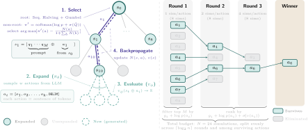
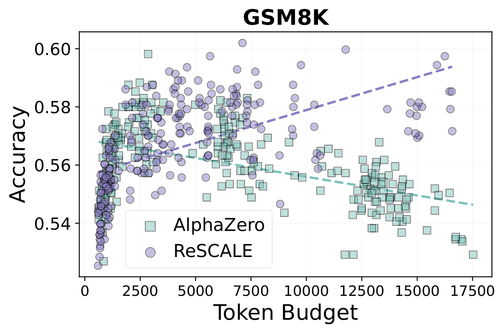

# ReSCALE: Reasoning via Scalable Compute Allocation for LLM Exploration

**ReSCALE** is a modified Gumbel AlphaZero MCTS that replaces Dirichlet noise and PUCT with Gumbel sampling and Sequential Halving, restoring consistent performance scaling without retraining the model.

[](https://arxiv.org/abs/2603.21162)


<p align="center">

</p>

[//]: # (<p align="center">)

[//]: # ()

[//]: # (</p>)


**GSM8k**

| Budget | Tokens  | Method    |          Acc. (%) | Max. Acc. (%) |
|:--------|:--------|:----------|------------------:|:--------------:|
| **Small**  | 0.5K–2K | AlphaZero |        56.0 ± 1.2 |          58.8 |
|            |         | ReSCALE   |        55.1 ± 1.1 |          58.6 |
| **Medium** | 6K–8K   | AlphaZero |        56.7 ± 0.9 |          58.3 |
|            |         | ReSCALE   |        57.9 ± 1.0 |          60.2 |
| **Large**  | 16K–18K | AlphaZero |        53.6 ± 0.7 |          55.0 |
|            |         | ReSCALE   |        58.4 ± 0.9 |          59.7 |
| **—**      | 3.5K    | Best-of-N |        53.4 ± 0.4 |             - |

**Game24**

| Budget | Tokens  | Method     |  Acc. (%)   | Max. Acc. (%) |
|:--------|:--------|:------------|:-----------:|:--------------:|
| **Small**  | 0.2K–2K | AlphaZero  | 74.4 ± 12.0 |          86.7 |
|            |         | ReSCALE    | 71.6 ± 10.5 |          81.2 |
| **Medium** | 2K–4K   | AlphaZero  | 84.3 ± 1.0  |          86.2 |
|            |         | ReSCALE    | 83.4 ± 1.4  |          85.9 |
| **Large**  | 4K–6K   | AlphaZero  | 82.9 ± 1.1  |          84.8 |
|            |         | ReSCALE    | 85.3 ± 0.6  |          85.9 |
| **—**      | 2.5K    | Best-of-N  | 54.1 ± 1.0  |             - |


## Installation:

This repository is based on: https://github.com/waterhorse1/LLM_Tree_Search.git

1. Install torch==2.2.0
2. `pip install -r /path_to_repo/requirements.txt`
3. `cd /path_to_repo && pip install -e .`


# 1  GSM8k

## 1.1 SFT
```
cd /path_to_repo/train_mcts_scripts/gsm8k

# Default configuration for 8-GPU training: adjust in mcts_gsm8k_llama_deepspeed.yaml and train_gsm8k_sft.py
export CUDA_VISIBLE_DEVICES=0,1,2,3,4,5,6,7
accelerate launch --config_file mcts_gsm8k_llama_deepspeed.yaml train_gsm8k_sft.py --checkpoint_dir=sft
```
After 3 epochs of training, the sft folder contains checkpoint folders: checkpoint_0_ep0, checkpoint_1_ep1, and checkpoint_2_ep2.

## 1.2 Convert SFT checkpoints using CTranslate2
```
ct2-transformers-converter --model sft/checkpoint_0_ep0 --quantization bfloat16 --output_dir sft_ctranslate2/llama2_sft_ep1_ct2
ct2-transformers-converter --model sft/checkpoint_1_ep1 --quantization bfloat16 --output_dir sft_ctranslate2/llama2_sft_ep2_ct2
ct2-transformers-converter --model sft/checkpoint_2_ep2 --quantization bfloat16 --output_dir sft_ctranslate2/llama2_sft_ep3_ct2
```

## 1.3 Generate data for value network training
```
cd /path_to_repo/tsllm/offline_rl

# Data generation
export CUDA_VISIBLE_DEVICES=0,1,2,3,4,5,6,7
sh gsm8k_data/gen_3.sh /path_to_repo/train_mcts_scripts/gsm8k/sft_ctranslate2 /path_to_repo/train_mcts_scripts/gsm8k/sft/checkpoint_0_ep0

# Data processing
sh gsm8k_data/process.sh
```

## 1.4 Train the value network
```
cd /path_to_repo/train_mcts_scripts/gsm8k
accelerate launch --config_file mcts_gsm8k_llama_deepspeed.yaml train_gsm8k_critic.py --checkpoint_dir=value
```
After 3 epochs, the value folder contains checkpoint folders: checkpoint_0_ep0, checkpoint_1_ep1, and checkpoint_2_ep2.

## 1.5 Run MCTS on the test dataset split
```
cd /path_to_repo
save_dir=gsm8k_result
seed=0
simulations=30
actions=16
length=16
n_gpus=8
ct2_dir=/path_to_repo/train_mcts_scripts/gsm8k/sft_ctranslate2/llama2_sft_ep3_ct2
critic_model_path=/path_to_repo/train_mcts_scripts/gsm8k/value/checkpoint_2_ep2

# method=mcts.gumbel for ReSCALE, method=mcts.get_next_action for AlphaZero
method=mcts.gumbel

export CUDA_VISIBLE_DEVICES=0,1,2,3,4,5,6,7
mkdir -p ${save_dir}
bash run_mcts.sh --save_path ${save_path} --seed ${seed} --simulations ${simulations} --actions ${actions} \
--length ${length} --n_gpus ${n_gpus} --ct2_dir ${ct2_dir} --critic_model_path ${critic_model_path} --method ${method} \
--env_name gsm8k

# Generated completions are saved to ${save_dir}/"${seed}"_sim-"${simulations}"_len-"${length}"_act-"${actions}"
```

## 1.6 Run MCTS using parameters from a file
```
cd /path_to_repo
save_dir=gsm8k_rescale_result
seed=0
n_gpus=8
ct2_dir=/path_to_repo/train_mcts_scripts/gsm8k/sft_ctranslate2/llama2_sft_ep3_ct2
critic_model_path=/path_to_repo/train_mcts_scripts/gsm8k/value/checkpoint_2_ep2
method=mcts.gumbel

# The parameters tested are provided in the data folder
parameters_path=/path_to_repo/data/gsm8k_rescale.tsv

export CUDA_VISIBLE_DEVICES=0,1,2,3,4,5,6,7
mkdir -p ${save_dir}
bash batch_run_mcts.sh --save_path ${save_path} --seed ${seed} --n_gpus ${n_gpus} --ct2_dir ${ct2_dir} \
--critic_model_path ${critic_model_path} --method ${method} --parameters_path ${parameters_path} --env_name gsm8k
```


# 2 Game24
For the Game24 dataset, repeat steps 1.1–1.5 using the scripts in the `/path_to_repo/train_mcts_scripts/game24` folder with the `--env_name game24` flag.

# 3 Best-of-N
Generate candidates with the SFT Llama2-7B and score them using the critic model.

```
cd /path_to_repo
export CUDA_VISIBLE_DEVICES=0

# GSM8k
ct2_dir=/path_to_repo/train_mcts_scripts/gsm8k/sft_ctranslate2/llama2_sft_ep3_ct2
critic_model_path=/path_to_repo/train_mcts_scripts/gsm8k/value/checkpoint_2_ep2
python scripts/gsm8k_bon.py --ct2_path ${ct2_dir} --critic_model_path ${critic_model_path} --n 32 --output gsm8k_bon32.json

# Game24
ct2_dir=/path_to_repo/train_mcts_scripts/game24/sft_ctranslate2/llama2_sft_ep3_ct2
critic_model_path=/path_to_repo/train_mcts_scripts/game24/value/checkpoint_2_ep2
python scripts/game24_bon.py --dataset_path tsllm/envs/game24/train_data/test_dedup.jsonl --ct2_path ${ct2_dir} --critic_model_path ${critic_model_path} --n 32 --output game24_bon32.json
```


**Troubleshooting CTranslate2 issues on CUDA 12**:

`RuntimeError: Library libcublas.so.11 is not found or cannot be loaded`

https://github.com/OpenNMT/CTranslate2/issues/1250#issuecomment-1936533861
